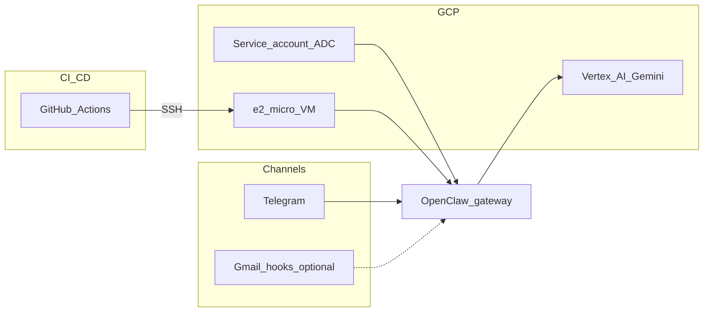

# OpenClaw GCP Agent Template


**Cloneable portfolio project:** run the [OpenClaw](https://docs.openclaw.ai/) gateway on **Google Cloud** with **Docker Compose**, **Vertex AI (Gemini)**, **Telegram**, and **GitHub Actions** deploy over SSH—without committing secrets.

## 1. Project overview

This repository is a **deployment template**, not the upstream OpenClaw monorepo. It pins the official container image [`ghcr.io/openclaw/openclaw`](https://github.com/openclaw/openclaw/pkgs/container/openclaw), adds production-oriented scripts, CI/CD, and documentation so others can reproduce your stack quickly.

**Design goals**

- Public-safe defaults (`SAFE_MODE=true`, no Gmail hooks by default).
- **Full autonomy** only with explicit env flags and an acceptance variable.
- **No secrets in git** (`.env`, generated runtime env files, and SSH keys stay local; production secrets come from GCP Secret Manager).
- **Non-interactive** automation: Compose, bootstrap scripts, and Actions avoid TUI prompts.

## 2. Architecture



## 3. Features

| Area | What you get |
|------|----------------|
| Runtime | OpenClaw gateway + CLI image, official Compose-style services |
| LLM | **Vertex AI** via `google-vertex` + ADC (VM attached service account / IAM) |
| Channel | **Telegram** first (documented `channels add` flow) |
| Host | Ubuntu 24.04, Docker + Compose v2, optional 4G swap script |
| CI | ShellCheck, `docker compose config`, required files, lightweight secret-pattern scan |
| CD | Push to `main` → SSH → `git pull` → validate → `compose up` → `/healthz` |
| Safety | Documented autonomy modes mapped to `tools.exec` + `exec-approvals.json` |

## 4. Requirements

- **Docker** 24+ and **Docker Compose v2** (see `scripts/install-docker.sh` on the VM).
- **jq** (for `scripts/bootstrap-config.sh`).
- A **GCP project** with billing, **Compute Engine**, and **Vertex AI API** enabled.
- A **Telegram Bot token** from [@BotFather](https://t.me/BotFather).
- **GitHub** (optional) for Actions deploy.

**RAM:** OpenClaw’s docs recommend **~2 GB** for comfortable operation. **e2-micro (1 GB)** is a **fragile PoC**—use **4 GB swap** and a prebuilt image only, or move to **e2-small / e2-medium**. See [docs/COSTS.md](docs/COSTS.md).

## 5. Quick start (local or VM)

```bash
git clone https://github.com/<you>/openclaw.git
cd openclaw
cp .env.example .env
# Edit .env: GOOGLE_CLOUD_*, VERTEX_MODEL, and local TELEGRAM_BOT_TOKEN if USE_GSM_SECRETS=false
# For production on GCP: USE_GSM_SECRETS=true + Secret Manager names

./scripts/bootstrap-config.sh
./scripts/validate-env.sh   # set VALIDATION_LEVEL=minimal until Telegram is set, if needed
./scripts/fetch-secrets-gsm.sh   # only needed when USE_GSM_SECRETS=true

docker compose up -d
./scripts/healthcheck.sh
```

**One-command deploy after initial VM setup:** on the server, with `.env` + IAM configured, use `./scripts/deploy.sh` or `make deploy` (pulls latest `main`, fetches GSM secrets, restarts).

## 6. GCP setup

See **[docs/GCP_SETUP.md](docs/GCP_SETUP.md)** (project, APIs, VM, firewall, SSH, service account IAM).

## 7. Telegram bot setup

1. Create a bot with BotFather; copy the **HTTP API token**.
2. Local mode: put `TELEGRAM_BOT_TOKEN=...` in `.env`.  
   GCP production mode: store token in Secret Manager and set `USE_GSM_SECRETS=true`.
3. Register the channel (from repo root, gateway must be up):

   ```bash
   docker compose run -T --rm openclaw-cli channels add --channel telegram --token "$TELEGRAM_BOT_TOKEN"
   ```

Official reference: [Telegram channel](https://docs.openclaw.ai/channels/telegram).

## 8. Vertex AI setup

1. Enable **Vertex AI API** on your project.
2. Create/attach a **VM service account** with `roles/aiplatform.user` (plus optional Gmail API roles if you enable hooks—see [docs/GOOGLE_INTEGRATIONS.md](docs/GOOGLE_INTEGRATIONS.md)).
3. Set `GOOGLE_CLOUD_PROJECT`, `GOOGLE_CLOUD_LOCATION`, and `VERTEX_MODEL` in `.env`.

Verify model ids after deploy: `docker compose run -T --rm openclaw-cli models list --provider google-vertex` (exact CLI flags can vary by OpenClaw version—see [docs/DEPLOYMENT.md](docs/DEPLOYMENT.md)).

## 9. GitHub Actions setup

See **[docs/GITHUB_ACTIONS.md](docs/GITHUB_ACTIONS.md)**.

**Secrets (recommended)**

| Secret | Purpose |
|--------|---------|
| `GCP_VM_HOST` | VM IP or DNS |
| `GCP_VM_USER` | SSH user |
| `GCP_VM_SSH_KEY` | Private key (PEM) |
| `GCP_VM_PORT` | SSH port (optional; defaults to **22** if unset) |

## 10. Deployment

- **Manual:** `make deploy` or `./scripts/deploy.sh` on the VM (records `.deploy-state/` for `make rollback`).
- **CD:** push to `main` or `master` runs [.github/workflows/deploy.yml](.github/workflows/deploy.yml).

Compose reference: [OpenClaw Docker install](https://docs.openclaw.ai/install/docker).

## 11. Autonomy modes

| Variable | Default | Behavior |
|----------|---------|----------|
| `SAFE_MODE` | `true` (convention) | Conservative `tools.exec` + `exec-approvals.json` via bootstrap |
| `DEMO_MODE` | `false` | Stricter prompts; **no Gmail hooks**; portfolio-safe |
| `FULL_AUTONOMY` | `false` | YOLO-style exec policy **only if** `I_ACCEPT_FULL_AUTONOMY_RISK=1` |

`DEMO_MODE` and `FULL_AUTONOMY` are **mutually exclusive**. Details: [docs/SECURITY.md](docs/SECURITY.md).

## 12. Gmail / Calendar / Drive

- **Gmail (optional):** OpenClaw supports **Pub/Sub Gmail hooks**—off by default. See [Gmail Pub/Sub](https://docs.openclaw.ai/automation/gmail-pubsub) and [docs/GOOGLE_INTEGRATIONS.md](docs/GOOGLE_INTEGRATIONS.md).
- **Calendar / Drive:** not first-class Telegram-style channels in core docs; treat as **optional** (APIs, OAuth/service accounts, future tools/MCP). This template documents boundaries and TODOs—**do not enable by default**.

## 13. Cost estimate

Rough notes (prices change by region): [docs/COSTS.md](docs/COSTS.md).

## 14. Security warning

- A live gateway with tools and cloud credentials is **high risk**. Start in an **isolated GCP project**.
- Do **not** expose port **18789** to the public internet without hardening (TLS, auth, allowlists). Prefer **SSH tunnel** or private networking.
- **Never** commit `.env`, `.env.generated`, or PEM keys.

Read **[docs/SECURITY.md](docs/SECURITY.md)**.

## 15. Troubleshooting

See **[docs/TROUBLESHOOTING.md](docs/TROUBLESHOOTING.md)**.

## 16. Portfolio / demo screenshots

| Placeholder | Caption |
|-------------|---------|
|  | OpenClaw Control UI via SSH tunnel |
|  | `ping` / summarize workflow |
|  | VM + monitoring |

Add images under `docs/screenshots/` in your fork.

---

## First functional test

1. Deploy the stack; ensure `./scripts/healthcheck.sh` passes.
2. Telegram: send **`ping`** → expect a normal model reply.
3. On the VM host, create `workspace/inbox/test.txt` with arbitrary content.
4. Ask the bot to **summarize** it into `workspace/out/summary.md`.
5. Confirm `workspace/out/summary.md` exists on the host.

## Config examples

OpenClaw reads **`openclaw.json`** (JSON5-capable) under `OPENCLAW_CONFIG_DIR`. This repo ships fragments in [config/](config/); `scripts/bootstrap-config.sh` writes a minimal **`openclaw.json`** plus **`exec-approvals.json`**.

## Makefile

| Target | Action |
|--------|--------|
| `make setup` | Run `scripts/setup-server.sh` (sudo on VM) |
| `make dev` | Compose with `docker-compose.dev.yml` |
| `make up` / `down` / `restart` | Lifecycle |
| `make logs` | Tail gateway logs |
| `make health` | HTTP `/healthz` |
| `make deploy` / `rollback` | Scripted deploy / git rollback |
| `make validate` | `scripts/validate-env.sh` |
| `make backup` | Tarball config dir |
| `make clean` | `docker compose down -v` |

## License

MIT — see [LICENSE](LICENSE).

## References

- [OpenClaw documentation](https://docs.openclaw.ai/)
- [OpenClaw Docker](https://docs.openclaw.ai/install/docker)
- [Model providers](https://docs.openclaw.ai/concepts/model-providers)
- [Exec approvals](https://docs.openclaw.ai/tools/exec-approvals)
