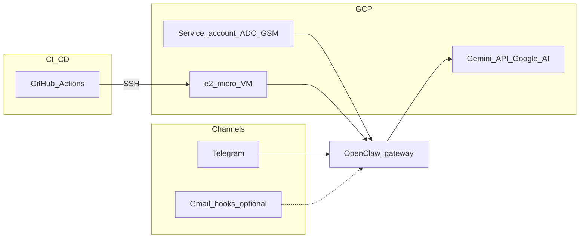

# OpenClaw GCP Agent Template


**Cloneable portfolio project:** run the [OpenClaw](https://docs.openclaw.ai/) gateway with **Docker Compose**, **Gemini (Google AI API key)**, and **Telegram**—on **your Mac or Linux workstation** (secrets in `.env`, optional **gog** for Google Workspace) or on **Google Cloud** with **GitHub Actions** deploy over SSH and optional **Secret Manager**—without committing secrets.

## 1. Project overview

This repository is a **deployment template**, not the upstream OpenClaw monorepo. It pins the official container image [`ghcr.io/openclaw/openclaw`](https://github.com/openclaw/openclaw/pkgs/container/openclaw), adds production-oriented scripts, CI/CD, and documentation so others can reproduce your stack quickly.

**Design goals**

- Public-safe defaults (`SAFE_MODE=true`, no Gmail hooks by default).
- **Full autonomy** only with explicit env flags and an acceptance variable.
- **No secrets in git** (`.env`, generated runtime env files, and SSH keys stay local; on GCP, production secrets can come from **Secret Manager** when `USE_GSM_SECRETS=true`).
- **Non-interactive** automation: Compose, bootstrap scripts, and Actions avoid TUI prompts.

## 2. Architecture



## 3. Features

| Area | What you get |
|------|----------------|
| Runtime | OpenClaw gateway + CLI image, official Compose-style services |
| LLM | **Gemini** (`LLM_PROVIDER=google` or unset) via **`google`** + **`GEMINI_API_KEY`**, or **OpenAI** (`LLM_PROVIDER=openai`) + **`OPENAI_API_KEY`** — see **`.env.example`**; **`./scripts/bootstrap-config.sh`** sets **`agents.defaults.model.primary`** |
| Channel | **Telegram** first (documented `channels add` flow) |
| Host | Ubuntu 24.04 VM (GCP) or **local Docker** (macOS/Linux) with Docker + Compose v2 |
| CI | ShellCheck, `./scripts/docker-compose.sh config`, required files, lightweight secret-pattern scan |
| CD | Push to `main` → SSH → `git pull` → validate → `compose up` → `/healthz` |
| Safety | Documented autonomy modes mapped to `tools.exec` + `exec-approvals.json` |

## 4. Requirements

- **Docker** 24+ and **Docker Compose v2** (see `scripts/install-docker.sh` on the VM).
- **jq** (for `scripts/bootstrap-config.sh`).
- **Local Docker only:** Docker + Compose v2, **jq**, and a **Telegram** bot token plus **Gemini** API key in `.env` (`USE_GSM_SECRETS=false`). You still set **`GOOGLE_CLOUD_PROJECT`** / **`GOOGLE_CLOUD_LOCATION`** in `.env` for validation and for Google API/OAuth alignment (same project as AI Studio / Workspace APIs)—no VM required.
- **GCP VM deploy:** a **GCP project** with billing and **Compute Engine** (VM host). **Secret Manager** when using `USE_GSM_SECRETS=true`. **Vertex AI API** is optional (only if you use `google-vertex` instead of the default `google` provider).
- A **Telegram Bot token** from [@BotFather](https://t.me/BotFather).
- **GitHub** (optional) for Actions deploy.

**RAM:** OpenClaw’s docs recommend **~2 GB** for comfortable operation. **e2-micro (1 GB)** is a **fragile PoC**—use **4 GB swap** and a prebuilt image only, or move to **e2-small / e2-medium**. See [docs/COSTS.md](docs/COSTS.md).

## 5. Quick start

### Local Mac / Linux (fastest — Docker only)

**Prereqs:** [Docker](https://docs.docker.com/get-docker/) 24+ with Compose v2, `jq`, `curl`.

```bash
git clone https://github.com/<you>/openclaw.git
cd openclaw
make init          # step 1: creates .env — edit it, then make init again (exits cleanly, not an error)
```

**Edit `.env` before the second `make init`** (minimum). If secrets are still empty, `make init` prints what’s missing and exits successfully again:

| Variable | Required |
|----------|----------|
| `GOOGLE_CLOUD_PROJECT`, `GOOGLE_CLOUD_LOCATION` | Yes (project/region alignment) |
| `TELEGRAM_BOT_TOKEN` | Yes (from [@BotFather](https://t.me/BotFather)) |
| `GEMINI_API_KEY` **or** `OPENAI_API_KEY` | One only — depends on `LLM_PROVIDER` (`google` default → Gemini; `openai` → OpenAI) |

Optional: `GOG_*` and host `gog auth` for Google Workspace — see [docs/GOOGLE_INTEGRATIONS.md](docs/GOOGLE_INTEGRATIONS.md).

**What `make init` runs** (`scripts/setup-local.sh`): bootstrap config → validate → download **Linux ELF** `gog` → sync host gogcli if present → `docker compose pull` → **`up -d --force-recreate`** (dev limits) → push gog into the container → register Telegram → `/healthz`.

After setup: message your bot (`ping`). Use **`/approve`** if pairing is prompted.

**Day-2 commands:**

| Command | When |
|---------|------|
| `make restart-dev` | After `.env`, gog, or compose changes (recreate + gog push) |
| `make logs` / `make health` | Debug |
| `make sync-gog-config` | After `gog auth` on the host |
| `SKIP_GOG=1 make init` | Telegram + LLM only, no gog |

**Do not** use plain `docker compose restart` on this stack — the CLI shares the gateway network namespace. Use **`make restart-dev`** or **`make local`**.

If the official image is **linux/amd64** only on **Apple Silicon**, add a Compose override with `platform: linux/amd64` (slower startup).

### GCP VM (production)

**Prereqs:** Ubuntu 24.04 VM, IAM (Secret Manager accessor on the VM service account if using GSM). Docker installed, or use `INSTALL_HOST_DEPS=1` on first `make init-vm` (sudo). `make` is installed by `setup-server.sh`; without it run `./scripts/init-vm.sh` directly.

```bash
git clone https://github.com/<you>/openclaw.git
cd openclaw
make init-vm          # step 1: creates .env — edit (USE_GSM_SECRETS=true, GSM_*, …), then make init-vm again
```

**Typical `.env` on the VM:** `USE_GSM_SECRETS=true`, `GOOGLE_CLOUD_PROJECT`, `GOOGLE_CLOUD_LOCATION`, `GSM_TELEGRAM_BOT_TOKEN_SECRET`, and `GSM_GEMINI_API_KEY_SECRET` or `GSM_OPENAI_API_KEY_SECRET` matching `LLM_PROVIDER` (not both).

**What `make init-vm` runs:** optional host Docker install → reown mounts → bootstrap → validate → `fetch-secrets-gsm.sh` → gog (optional) → **production** `docker compose` → Telegram `channels add` → `/healthz`.

```bash
# First boot without Docker yet:
INSTALL_HOST_DEPS=1 make init-vm

# After the stack is up:
make deploy    # git pull + restart (ongoing updates)
make restart   # recreate production stack without git pull
```

Manual steps (equivalent to `make init-vm`) are still in [docs/GCP_SETUP.md](docs/GCP_SETUP.md) and [docs/DEPLOYMENT.md](docs/DEPLOYMENT.md).

## 6. GCP setup

See **[docs/GCP_SETUP.md](docs/GCP_SETUP.md)** (project, APIs, VM, firewall, SSH, service account IAM).

## 7. Telegram bot setup

1. Create a bot with BotFather; copy the **HTTP API token**.
2. Local mode: put `TELEGRAM_BOT_TOKEN=...` in `.env`.  
   GCP production mode: store token in Secret Manager and set `USE_GSM_SECRETS=true`.
3. Register the channel (from repo root, gateway must be up):

   ```bash
   ./scripts/docker-compose.sh run -T --rm openclaw-cli channels add --channel telegram --token "$TELEGRAM_BOT_TOKEN"
   ```

Official reference: [Telegram channel](https://docs.openclaw.ai/channels/telegram).

## 8. LLM (Gemini or OpenAI)

**Default (Gemini / Google AI Studio)**

1. In [Google AI Studio](https://aistudio.google.com/apikey), create an API key for your Google Cloud project.
2. Put **`GEMINI_API_KEY=...`** in **`.env`** on the VM, **or** store the key in **Secret Manager**, set **`GSM_GEMINI_API_KEY_SECRET`**, and run **`./scripts/fetch-secrets-gsm.sh`** (see [docs/GOOGLE_INTEGRATIONS.md](docs/GOOGLE_INTEGRATIONS.md)).
3. Set **`LLM_PROVIDER=google`** (or omit it), **`GEMINI_MODEL`** in **`.env`** (default **`gemini-3-flash-preview`**). Run **`./scripts/bootstrap-config.sh`**, then **`make restart-dev`**.

**Switch to OpenAI**

1. Set **`LLM_PROVIDER=openai`**, **`OPENAI_API_KEY=...`**, and optionally **`OPENAI_MODEL`** (default **`gpt-4.1-mini`**) in **`.env`**.
2. Run **`./scripts/bootstrap-config.sh`** then **`make restart-dev`** (bootstrap merges **`openai/<OPENAI_MODEL>`** into **`agents.defaults.model.primary`** without wiping the rest of **`openclaw.json`** when the file already exists).

Verify model ids after deploy:

```bash
./scripts/docker-compose.sh run -T --rm openclaw-cli models list --provider google
./scripts/docker-compose.sh run -T --rm openclaw-cli models list --provider openai
```

(Optional) **Vertex AI** (`google-vertex` + ADC) is documented in [docs/GOOGLE_INTEGRATIONS.md](docs/GOOGLE_INTEGRATIONS.md) if your OpenClaw image includes that provider.

## 9. GitHub Actions setup

See **[docs/GITHUB_ACTIONS.md](docs/GITHUB_ACTIONS.md)**.

**Secrets (recommended)**

| Secret | Purpose |
|--------|---------|
| `GCP_VM_HOST` | VM IP or DNS |
| `GCP_VM_USER` | SSH user |
| `GCP_VM_SSH_KEY` | Private key (PEM) |
| `GCP_VM_PORT` | SSH port (optional; defaults to **22** if unset) |

## 10. Deployment

- **Manual:** `make deploy` or `./scripts/deploy.sh` on the VM (records `.deploy-state/` for `make rollback`).
- **CD:** push to `main` or `master` runs [.github/workflows/deploy.yml](.github/workflows/deploy.yml).

Compose reference: [OpenClaw Docker install](https://docs.openclaw.ai/install/docker).

## 11. Autonomy modes

| Variable | Default | Behavior |
|----------|---------|----------|
| `SAFE_MODE` | `true` (convention) | Conservative `tools.exec` + `exec-approvals.json` via bootstrap |
| `DEMO_MODE` | `false` | Stricter prompts; **no Gmail hooks**; portfolio-safe |
| `FULL_AUTONOMY` | `false` | YOLO-style exec policy **only if** `I_ACCEPT_FULL_AUTONOMY_RISK=1` |
| `TRUSTED_HEADLESS_EXEC` | `false` | Same gateway **exec** policy as full autonomy **without** flipping other YOLO flags — use on a **Telegram-only VM** when no [Control UI](https://docs.openclaw.ai/gateway/control-ui) is open (requires **`I_ACCEPT_HEADLESS_EXEC_RISK=1`**) |

`DEMO_MODE` is **mutually exclusive** with **`FULL_AUTONOMY`** and with **`TRUSTED_HEADLESS_EXEC`**. Details: [docs/SECURITY.md](docs/SECURITY.md).

## 12. Gmail / Calendar / Drive

- **Gmail (optional):** OpenClaw supports **Pub/Sub Gmail hooks**—off by default. See [Gmail Pub/Sub](https://docs.openclaw.ai/automation/gmail-pubsub) and [docs/GOOGLE_INTEGRATIONS.md](docs/GOOGLE_INTEGRATIONS.md).
- **Sending email from chat:** install a **skill** (Gmail/SMTP, etc.) via [ClawHub](https://documentation.openclaw.ai/clawhub) / upstream; not included in this template.
- **Google Calendar from chat:** install a **Calendar API skill** (search `openclaw skills search "calendar"`), enable **Google Calendar API** in GCP, complete OAuth (or service-account / domain-wide delegation per skill). See [docs/GOOGLE_INTEGRATIONS.md](docs/GOOGLE_INTEGRATIONS.md).
- **Google Drive from chat:** install a **Drive or Workspace skill** (`openclaw skills search "drive"`), enable **Google Drive API** in GCP, complete auth per skill. See [docs/GOOGLE_INTEGRATIONS.md](docs/GOOGLE_INTEGRATIONS.md).
- **Headless VM + shell tools:** if **exec approval** requests time out, use an **SSH tunnel** to the Control UI on **18789** or set **`TRUSTED_HEADLESS_EXEC`** (see [docs/SECURITY.md](docs/SECURITY.md) and [docs/TROUBLESHOOTING.md](docs/TROUBLESHOOTING.md)).

## 13. Cost estimate

Rough notes (prices change by region): [docs/COSTS.md](docs/COSTS.md).

## 14. Security warning

- A live gateway with tools and cloud credentials is **high risk**. Start in an **isolated GCP project**.
- Do **not** expose port **18789** to the public internet without hardening (TLS, auth, allowlists). Prefer **SSH tunnel** or private networking.
- **Never** commit `.env`, `.env.generated`, or PEM keys.

Read **[docs/SECURITY.md](docs/SECURITY.md)**.

## 15. Troubleshooting

See **[docs/TROUBLESHOOTING.md](docs/TROUBLESHOOTING.md)**.

## 16. Portfolio / demo screenshots

| Placeholder | Caption |
|-------------|---------|
|  | OpenClaw Control UI via SSH tunnel |
|  | `ping` / summarize workflow |
|  | VM + monitoring |

Add images under `docs/screenshots/` in your fork.

---

## First functional test

1. Deploy the stack; ensure `./scripts/healthcheck.sh` passes.
2. Telegram: send **`ping`** → expect a normal model reply.
3. On the VM host, create `workspace/inbox/test.txt` with arbitrary content.
4. Ask the bot to **summarize** it into `workspace/out/summary.md`.
5. Confirm `workspace/out/summary.md` exists on the host.

## Config examples

OpenClaw reads **`openclaw.json`** (JSON5-capable) under `OPENCLAW_CONFIG_DIR`. This repo ships fragments in [config/](config/); `scripts/bootstrap-config.sh` writes **`exec-approvals.json`** and either **creates** a minimal **`openclaw.json`** or **merges** **`agents.defaults.model.primary`** + **`tools.exec`** into an existing file when you switch **`LLM_PROVIDER`** or autonomy flags.

## Makefile

| Target | Action |
|--------|--------|
| **`make init`** | **New clone (local Mac/Linux):** `.env` → bootstrap → gog → dev compose → Telegram → healthz |
| **`make init-vm`** | **New GCP VM:** GSM/local secrets → production compose → Telegram → healthz (Linux only) |
| `make setup-local` / `setup-vm` | Same as `init` / `init-vm` when `.env` already exists |
| `make setup` | VM host packages only: `scripts/setup-server.sh` (sudo) |
| `make dev` / `make local` | Dev compose up (**`--force-recreate`** + gog push); use after `make init` |
| `make up` / `down` / `restart` | Production compose lifecycle |
| `make restart-dev` / `restart-local` | Dev compose **`--force-recreate`** + gog push |
| `make logs` | Tail gateway logs |
| `make health` | HTTP `/healthz` |
| `make deploy` / `rollback` | Scripted deploy / git rollback |
| `make validate` | `scripts/validate-env.sh` |
| `make backup` | Tarball config dir |
| `make sync-gog-config` | Copy host gogcli state + ownership for Docker; on macOS may **`docker cp`** into a running gateway |
| `make push-gog-gateway` | Stream staged **`.openclaw-gog-config`** into the gateway’s **gogcli Docker volume** (`tar` + `docker exec`) |
| `make install-gog-linux` | Download **Linux ELF** `gog` into `.openclaw-host-bin/` (Mac Docker — containers are Linux) |
| `make clean` | `./scripts/docker-compose.sh down -v` |

## License

MIT — see [LICENSE](LICENSE).

## References

- [OpenClaw documentation](https://docs.openclaw.ai/)
- [OpenClaw Docker](https://docs.openclaw.ai/install/docker)
- [Model providers](https://docs.openclaw.ai/concepts/model-providers)
- [Exec approvals](https://docs.openclaw.ai/tools/exec-approvals)
