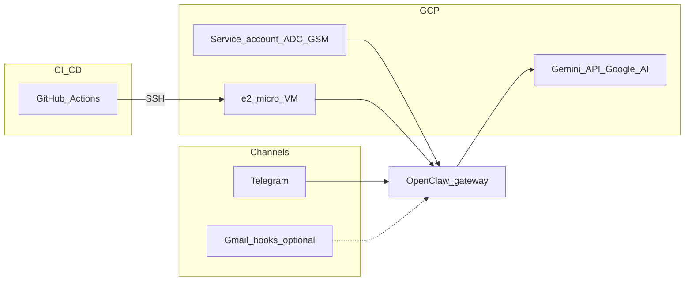

# OpenClaw GCP Agent Template


**Cloneable portfolio project:** run the [OpenClaw](https://docs.openclaw.ai/) gateway with **Docker Compose**, **Gemini (Google AI API key)**, and **Telegram**—on **your Mac or Linux workstation** (secrets in `.env`, optional **gog** for Google Workspace) or on **Google Cloud** with **GitHub Actions** deploy over SSH and optional **Secret Manager**—without committing secrets.

## 1. Project overview

This repository is a **deployment template**, not the upstream OpenClaw monorepo. It pins the official container image [`ghcr.io/openclaw/openclaw`](https://github.com/openclaw/openclaw/pkgs/container/openclaw), adds production-oriented scripts, CI/CD, and documentation so others can reproduce your stack quickly.

**Design goals**

- Public-safe defaults (`SAFE_MODE=true`, no Gmail hooks by default).
- **Full autonomy** only with explicit env flags and an acceptance variable.
- **No secrets in git** (`.env`, generated runtime env files, and SSH keys stay local; on GCP, production secrets can come from **Secret Manager** when `USE_GSM_SECRETS=true`).
- **Non-interactive** automation: Compose, bootstrap scripts, and Actions avoid TUI prompts.

## 2. Architecture



## 3. Features

| Area | What you get |
|------|----------------|
| Runtime | OpenClaw gateway + CLI image, official Compose-style services |
| LLM | **Gemini** (`LLM_PROVIDER=google` or unset) via **`google`** + **`GEMINI_API_KEY`**, or **OpenAI** (`LLM_PROVIDER=openai`) + **`OPENAI_API_KEY`** — see **`.env.example`**; **`./scripts/bootstrap-config.sh`** sets **`agents.defaults.model.primary`** |
| Channel | **Telegram** first (documented `channels add` flow) |
| Host | Ubuntu 24.04 VM (GCP) or **local Docker** (macOS/Linux) with Docker + Compose v2 |
| CI | ShellCheck, `./scripts/docker-compose.sh config`, required files, lightweight secret-pattern scan |
| CD | Push to `main` → SSH → `git pull` → validate → `compose up` → `/healthz` |
| Safety | Documented autonomy modes mapped to `tools.exec` + `exec-approvals.json` |

## 4. Requirements

- **Docker** 24+ and **Docker Compose v2** (see `scripts/install-docker.sh` on the VM).
- **jq** (for `scripts/bootstrap-config.sh`).
- **Local Docker only:** Docker + Compose v2, **jq**, and a **Telegram** bot token plus **Gemini** API key in `.env` (`USE_GSM_SECRETS=false`). You still set **`GOOGLE_CLOUD_PROJECT`** / **`GOOGLE_CLOUD_LOCATION`** in `.env` for validation and for Google API/OAuth alignment (same project as AI Studio / Workspace APIs)—no VM required.
- **GCP VM deploy:** a **GCP project** with billing and **Compute Engine** (VM host). **Secret Manager** when using `USE_GSM_SECRETS=true`. **Vertex AI API** is optional (only if you use `google-vertex` instead of the default `google` provider).
- A **Telegram Bot token** from [@BotFather](https://t.me/BotFather).
- **GitHub** (optional) for Actions deploy.

**RAM:** OpenClaw’s docs recommend **~2 GB** for comfortable operation. **e2-micro (1 GB)** is a **fragile PoC**—use **4 GB swap** and a prebuilt image only, or move to **e2-small / e2-medium**. See [docs/COSTS.md](docs/COSTS.md).

## 5. Quick start (local or VM)

```bash
git clone https://github.com/<you>/openclaw.git
cd openclaw
cp .env.example .env
# Edit .env: GOOGLE_CLOUD_*, GEMINI_API_KEY (or GSM), GEMINI_MODEL, TELEGRAM_BOT_TOKEN if USE_GSM_SECRETS=false
# For production on GCP: USE_GSM_SECRETS=true + Secret Manager names (Telegram required; optional GSM_OPENAI_* / GSM_GEMINI_* for API keys)

./scripts/bootstrap-config.sh
./scripts/validate-env.sh   # set VALIDATION_LEVEL=minimal until Telegram is set, if needed
./scripts/fetch-secrets-gsm.sh   # only needed when USE_GSM_SECRETS=true

./scripts/docker-compose.sh up -d
./scripts/healthcheck.sh
```

**One-command deploy after initial VM setup:** on the server, with `.env` + IAM configured, use `./scripts/deploy.sh` or `make deploy` (pulls latest `main`, fetches GSM secrets, restarts).

### Local workstation (e.g. Mac, Docker only, no Secret Manager)

Use the same repo and Compose files as production; keep **`USE_GSM_SECRETS=false`** and store **`GEMINI_API_KEY`**, **`TELEGRAM_BOT_TOKEN`**, and any **`GOG_*`** values in **`.env`**. Skip **`./scripts/fetch-secrets-gsm.sh`** (it removes `.env.generated` and exits when GSM is off).

1. **`cp .env.example .env`** — fill tokens and set **`GOOGLE_CLOUD_PROJECT`** / **`GOOGLE_CLOUD_LOCATION`** (see comment block at top of `.env.example`).
2. **`./scripts/bootstrap-config.sh`** then **`./scripts/validate-env.sh`** (use **`VALIDATION_LEVEL=minimal`** in `.env` until Telegram is set, if you prefer).
3. **`make local`** (or **`./scripts/docker-compose.sh -f docker-compose.dev.yml up -d`**) for a **2 GB / 2 CPU** gateway cap suitable for a laptop.
4. **`./scripts/healthcheck.sh`**, then register Telegram:  
   `./scripts/docker-compose.sh run -T --rm openclaw-cli channels add --channel telegram --token "$TELEGRAM_BOT_TOKEN"`.

**gog (Drive / Calendar / Mail via [gogcli](https://github.com/openclaw/gogcli)):** OpenClaw runs in a **Linux** container. A **macOS Homebrew `gog` (Mach-O)** cannot execute there. Run **`make install-gog-linux`** (or **`./scripts/install-gog-linux-for-docker.sh`**) to download a **Linux ELF** `gog` into **`.openclaw-host-bin/gog`** (use **`GOG_LINUX_ARCH=arm64`** if your image is **linux/arm64**). **`./scripts/docker-compose.sh`** only adds the gog overlay when the mounted file is **Linux ELF**. On the **Mac host**, run **`gog auth`** so tokens live under **`~/Library/Application Support/gogcli`**, then **`make sync-gog-config`** to copy into **`.openclaw-gog-config`** (staging) and **`make push-gog-gateway`** (or **`make restart-dev`**) to load them into the **named Docker volume** used at **`/home/node/.config/gogcli`** (avoids Docker Desktop bind-mount issues). See [docs/GOOGLE_INTEGRATIONS.md](docs/GOOGLE_INTEGRATIONS.md).

If the official image is **linux/amd64** only on your **Apple Silicon** Mac, add a Compose override with **`platform: linux/amd64`** for the OpenClaw services (expect slower startup).

### Exact steps (Mac + Docker + gog + Telegram)

Run **from the repo root**, in order (anything with `sudo` needs your password):

1. **`cp .env.example .env`** and edit **`.env`** (tokens, **`GOOGLE_CLOUD_*`**, optional **`GOG_*`**).
2. **`./scripts/bootstrap-config.sh`** then **`./scripts/validate-env.sh`** (use **`VALIDATION_LEVEL=minimal`** in `.env` until Telegram is set, if you prefer).
3. **`make install-gog-linux`** — Linux **ELF** `gog` into **`.openclaw-host-bin/`** (not Homebrew Mach-O).
4. On the **Mac host**: **`gog auth …`** until **`~/Library/Application Support/gogcli`** exists.
5. **`make sync-gog-config`** — copies gogcli → **`.openclaw-gog-config`** (host staging), fixes perms, inode refresh + **`xattr -cr`** on macOS, then streams into the gateway’s **named gogcli volume** via **`push-gogcli-to-gateway.sh`** when Docker is up.
6. If **`gog`** still cannot read mail: **`make push-gog-gateway`** (may ask for **sudo** so **`tar`** can read mode-**`600`** staging files). **`make restart-dev`** / **`local`** / **`dev`** also run the push after a short sleep.
7. **`make local`**, **`./scripts/healthcheck.sh`**
8. **`make verify-gog`** — confirm ELF magic **`7f 45 4c 46`** on gateway + CLI.
9. Telegram: **`./scripts/docker-compose.sh run -T --rm openclaw-cli channels add …`** then **`/approve`** pairing if prompted.
10. After any gog or compose change: **`make restart-dev`** (not **`docker compose restart`** only the gateway). **`make sync-gog-config`** again whenever you re-auth **`gog`** on the host; **`restart-dev`** / **`local`** / **`dev`** run **`push-gogcli-to-gateway.sh`** after a short sleep.

Optional: **“model idle timeout”** — merge **`config/openclaw-timeouts.example.json5`** into **`openclaw.json`** only after confirming your **`OPENCLAW_IMAGE`** accepts those keys ([docs/TROUBLESHOOTING.md](docs/TROUBLESHOOTING.md)); then **`make restart-dev`**.

## 6. GCP setup

See **[docs/GCP_SETUP.md](docs/GCP_SETUP.md)** (project, APIs, VM, firewall, SSH, service account IAM).

## 7. Telegram bot setup

1. Create a bot with BotFather; copy the **HTTP API token**.
2. Local mode: put `TELEGRAM_BOT_TOKEN=...` in `.env`.  
   GCP production mode: store token in Secret Manager and set `USE_GSM_SECRETS=true`.
3. Register the channel (from repo root, gateway must be up):

   ```bash
   ./scripts/docker-compose.sh run -T --rm openclaw-cli channels add --channel telegram --token "$TELEGRAM_BOT_TOKEN"
   ```

Official reference: [Telegram channel](https://docs.openclaw.ai/channels/telegram).

## 8. LLM (Gemini or OpenAI)

**Default (Gemini / Google AI Studio)**

1. In [Google AI Studio](https://aistudio.google.com/apikey), create an API key for your Google Cloud project.
2. Put **`GEMINI_API_KEY=...`** in **`.env`** on the VM, **or** store the key in **Secret Manager**, set **`GSM_GEMINI_API_KEY_SECRET`**, and run **`./scripts/fetch-secrets-gsm.sh`** (see [docs/GOOGLE_INTEGRATIONS.md](docs/GOOGLE_INTEGRATIONS.md)).
3. Set **`LLM_PROVIDER=google`** (or omit it), **`GEMINI_MODEL`** in **`.env`** (default **`gemini-3-flash-preview`**). Run **`./scripts/bootstrap-config.sh`**, then **`make restart-dev`**.

**Switch to OpenAI**

1. Set **`LLM_PROVIDER=openai`**, **`OPENAI_API_KEY=...`**, and optionally **`OPENAI_MODEL`** (default **`gpt-4.1-mini`**) in **`.env`**.
2. Run **`./scripts/bootstrap-config.sh`** then **`make restart-dev`** (bootstrap merges **`openai/<OPENAI_MODEL>`** into **`agents.defaults.model.primary`** without wiping the rest of **`openclaw.json`** when the file already exists).

Verify model ids after deploy:

```bash
./scripts/docker-compose.sh run -T --rm openclaw-cli models list --provider google
./scripts/docker-compose.sh run -T --rm openclaw-cli models list --provider openai
```

(Optional) **Vertex AI** (`google-vertex` + ADC) is documented in [docs/GOOGLE_INTEGRATIONS.md](docs/GOOGLE_INTEGRATIONS.md) if your OpenClaw image includes that provider.

## 9. GitHub Actions setup

See **[docs/GITHUB_ACTIONS.md](docs/GITHUB_ACTIONS.md)**.

**Secrets (recommended)**

| Secret | Purpose |
|--------|---------|
| `GCP_VM_HOST` | VM IP or DNS |
| `GCP_VM_USER` | SSH user |
| `GCP_VM_SSH_KEY` | Private key (PEM) |
| `GCP_VM_PORT` | SSH port (optional; defaults to **22** if unset) |

## 10. Deployment

- **Manual:** `make deploy` or `./scripts/deploy.sh` on the VM (records `.deploy-state/` for `make rollback`).
- **CD:** push to `main` or `master` runs [.github/workflows/deploy.yml](.github/workflows/deploy.yml).

Compose reference: [OpenClaw Docker install](https://docs.openclaw.ai/install/docker).

## 11. Autonomy modes

| Variable | Default | Behavior |
|----------|---------|----------|
| `SAFE_MODE` | `true` (convention) | Conservative `tools.exec` + `exec-approvals.json` via bootstrap |
| `DEMO_MODE` | `false` | Stricter prompts; **no Gmail hooks**; portfolio-safe |
| `FULL_AUTONOMY` | `false` | YOLO-style exec policy **only if** `I_ACCEPT_FULL_AUTONOMY_RISK=1` |
| `TRUSTED_HEADLESS_EXEC` | `false` | Same gateway **exec** policy as full autonomy **without** flipping other YOLO flags — use on a **Telegram-only VM** when no [Control UI](https://docs.openclaw.ai/gateway/control-ui) is open (requires **`I_ACCEPT_HEADLESS_EXEC_RISK=1`**) |

`DEMO_MODE` is **mutually exclusive** with **`FULL_AUTONOMY`** and with **`TRUSTED_HEADLESS_EXEC`**. Details: [docs/SECURITY.md](docs/SECURITY.md).

## 12. Gmail / Calendar / Drive

- **Gmail (optional):** OpenClaw supports **Pub/Sub Gmail hooks**—off by default. See [Gmail Pub/Sub](https://docs.openclaw.ai/automation/gmail-pubsub) and [docs/GOOGLE_INTEGRATIONS.md](docs/GOOGLE_INTEGRATIONS.md).
- **Sending email from chat:** install a **skill** (Gmail/SMTP, etc.) via [ClawHub](https://documentation.openclaw.ai/clawhub) / upstream; not included in this template.
- **Google Calendar from chat:** install a **Calendar API skill** (search `openclaw skills search "calendar"`), enable **Google Calendar API** in GCP, complete OAuth (or service-account / domain-wide delegation per skill). See [docs/GOOGLE_INTEGRATIONS.md](docs/GOOGLE_INTEGRATIONS.md).
- **Google Drive from chat:** install a **Drive or Workspace skill** (`openclaw skills search "drive"`), enable **Google Drive API** in GCP, complete auth per skill. See [docs/GOOGLE_INTEGRATIONS.md](docs/GOOGLE_INTEGRATIONS.md).
- **Headless VM + shell tools:** if **exec approval** requests time out, use an **SSH tunnel** to the Control UI on **18789** or set **`TRUSTED_HEADLESS_EXEC`** (see [docs/SECURITY.md](docs/SECURITY.md) and [docs/TROUBLESHOOTING.md](docs/TROUBLESHOOTING.md)).

## 13. Cost estimate

Rough notes (prices change by region): [docs/COSTS.md](docs/COSTS.md).

## 14. Security warning

- A live gateway with tools and cloud credentials is **high risk**. Start in an **isolated GCP project**.
- Do **not** expose port **18789** to the public internet without hardening (TLS, auth, allowlists). Prefer **SSH tunnel** or private networking.
- **Never** commit `.env`, `.env.generated`, or PEM keys.

Read **[docs/SECURITY.md](docs/SECURITY.md)**.

## 15. Troubleshooting

See **[docs/TROUBLESHOOTING.md](docs/TROUBLESHOOTING.md)**.

## 16. Portfolio / demo screenshots

| Placeholder | Caption |
|-------------|---------|
|  | OpenClaw Control UI via SSH tunnel |
|  | `ping` / summarize workflow |
|  | VM + monitoring |

Add images under `docs/screenshots/` in your fork.

---

## First functional test

1. Deploy the stack; ensure `./scripts/healthcheck.sh` passes.
2. Telegram: send **`ping`** → expect a normal model reply.
3. On the VM host, create `workspace/inbox/test.txt` with arbitrary content.
4. Ask the bot to **summarize** it into `workspace/out/summary.md`.
5. Confirm `workspace/out/summary.md` exists on the host.

## Config examples

OpenClaw reads **`openclaw.json`** (JSON5-capable) under `OPENCLAW_CONFIG_DIR`. This repo ships fragments in [config/](config/); `scripts/bootstrap-config.sh` writes **`exec-approvals.json`** and either **creates** a minimal **`openclaw.json`** or **merges** **`agents.defaults.model.primary`** + **`tools.exec`** into an existing file when you switch **`LLM_PROVIDER`** or autonomy flags.

## Makefile

| Target | Action |
|--------|--------|
| `make setup` | Run `scripts/setup-server.sh` (sudo on VM) |
| `make dev` / `make local` | Compose with `docker-compose.dev.yml` (more RAM/CPU; same as local workstation) |
| `make up` / `down` / `restart` | Lifecycle (`restart` = **`up -d --force-recreate`**, not raw `docker compose restart`) |
| `make restart-dev` / `restart-local` | Same with **`docker-compose.dev.yml`** (use after **`make local`** / Mac dev) |
| `make logs` | Tail gateway logs |
| `make health` | HTTP `/healthz` |
| `make deploy` / `rollback` | Scripted deploy / git rollback |
| `make validate` | `scripts/validate-env.sh` |
| `make backup` | Tarball config dir |
| `make sync-gog-config` | Copy host gogcli state + ownership for Docker; on macOS may **`docker cp`** into a running gateway |
| `make push-gog-gateway` | Stream staged **`.openclaw-gog-config`** into the gateway’s **gogcli Docker volume** (`tar` + `docker exec`) |
| `make install-gog-linux` | Download **Linux ELF** `gog` into `.openclaw-host-bin/` (Mac Docker — containers are Linux) |
| `make clean` | `./scripts/docker-compose.sh down -v` |

## License

MIT — see [LICENSE](LICENSE).

## References

- [OpenClaw documentation](https://docs.openclaw.ai/)
- [OpenClaw Docker](https://docs.openclaw.ai/install/docker)
- [Model providers](https://docs.openclaw.ai/concepts/model-providers)
- [Exec approvals](https://docs.openclaw.ai/tools/exec-approvals)
